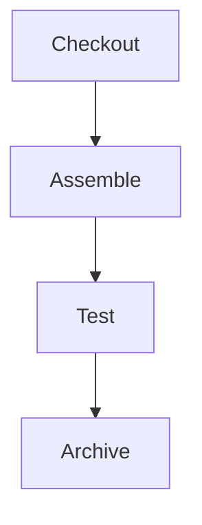

**Institution** Instituto Superior de Engenharia do Porto

**Program:** Switch Dev

**Course:** DevOps

**Author:** Francisco Almeida

## CA3 - CI/CD Pipelines with Jenkins

## Table of Contents

- [Introduction](#introduction)
- [GitHub Issues](#github-issues)
- [Environment Setup](#environment-setup)
    - [Jenkins Installation and Configuration](#jenkins-installation-and-configuration)
    - [Managing Jenkins](#managing-jenkins)
    - [Jenkins Pipeline Vocabulary](#jenkins-pipeline-vocabulary)
    - [Plugins Installed:](#plugins-installed)
    - [Credentials Configuration](#credentials-configuration)
    - [Overview](#overview)
    - [Operative Guidelines](#operative-guidelines)
- [Project Pipeline Details](#project-pipeline-details)
    - [Gradle Basic Demo Project Pipeline](#gradle-basic-demo-project-pipeline)
        - [Pipeline Definition (Jenkinsfile)](#pipeline-definition-jenkinsfile)
        - [Execution and Results](#execution-and-results)
    - [Spring Boot Application and Gradle "Basic" Version Pipeline](#spring-boot-application-and-gradle-basic-version-pipeline)
        - [Pipeline Definition (Jenkinsfile)](#pipeline-definition-jenkinsfile-1)
        - [Execution and Results](#execution-and-results-1)
- [Challenges and Solutions](#challenges-and-solutions)
- [Conclusion](#conclusion)

## Introduction

This technical report documents Class Assignment 3 (CA3) for the DevOps course, focusing on Continuous 
Integration/Continuous Delivery (CI/CD) Pipelines with Jenkins. It details the setup, configuration,
and implementation of CI/CD workflows for both the "gradle basic demo" project and a Spring Boot
application, integrating guidelines from existing project structures.

This assignment explores Jenkins' capabilities for CI/CD by automating build, test, and deployment
workflows for Gradle and Spring Boot projects. The pipelines include artifact archiving, Docker image
generation, and test reporting.

## GitHub Issues
As per the operative guidelines for CA3, issues were created in GitHub to track progress for the main tasks of this assignment.
These issues facilitated workflow management and documented specific challenges and solutions encountered during the
implementation of the CI/CD pipelines:

1. [#65 Implement CI/CD Pipeline for Gradle Basic Demo Project](https://github.com/FAlmeida-switch/devops-24-25-1241906/issues/65)
2. [#66 Implement CI/CD Pipeline for Spring Boot Application](https://github.com/FAlmeida-switch/devops-24-25-1241906/issues/66)
3. [#67 Document Technical Report and Tag Repository](https://github.com/FAlmeida-switch/devops-24-25-1241906/issues/67)

## Environment Setup
This section outlines the setup of the environment specifically tailored for running Jenkins and its 
associated CI/CD pipelines.

### Jenkins Installation and Configuration
Jenkins, a Java application, was installed directly on macOS using Homebrew. This involved utilizing
the jenkins-lts formula, which sets up Jenkins as a background service. The installation command used was
`brew install jenkins-lts`
Once installed, Jenkins was managed using Homebrew services commands (e.g., `brew services start 
jenkins-lts`, `brew services restart jenkins-lts`). Jenkins was accessed via http://localhost:8080.

### Managing Jenkins
Exploration of the "Manage Jenkins" interface was undertaken to understand how to utilize its administrative functionalities.
This included navigating system configuration settings, managing plugins, and configuring security aspects such as user
accounts and permissions. The main Jenkins dashboard, which provides an overview of all configured jobs and options for
creating new pipeline items, was also utilized.

### Jenkins Pipeline Vocabulary
This section defines key concepts and components essential for understanding and implementing Jenkins Pipelines. A clear
grasp of these terms is vital for structuring and debugging CI/CD workflows.

**Job**: In Jenkins, a Job represents a configured task or a complete build pipeline that 
Jenkins will execute.

**Node**: A Node (or Agent) is a machine or container where a Jenkins pipeline or specific steps are
run. It provides a workspace where the project's source code is checked out and built.

**Stage**: A Stage is a logical, user-defined section within a Jenkins Pipeline. It groups a set of 
related steps, making the pipeline structure clear and readable (e.g., "Checkout", "Build", "Test").

**Step**: A Step is a single task or command executed within a Stage. Examples include executing a 
shell script, checking out source code from a Git repository, or archiving artifacts.

### Plugins Installed:

- Docker Pipeline

- JUnit Reporter

- HTML Publisher

### Credentials Configuration
To securely access private repositories and Docker Hub, credentials were configured in Jenkins:

1. **GitHub/Bitbucket**:
    - Created an "App Password" in Bitbucket with `read:repository` permissions.
    - Stored in Jenkins as `bitbucket-creds` (Username + App Password).

2. **Docker Hub**:
    - Added a credential of type "Username and Password" with ID `docker-hub-credentials`.
    - Used in the pipeline to push images via `docker.withRegistry`.

### Overview
This assignment focuses on CI/CD Pipelines with Jenkins:

- Start Date: May 26
- End Date: June 11

**Development Repository**: My individual repository for the DevOps course.

### Operative Guidelines
The following guidelines were strictly followed for this assignment:

- All work was performed within the designated individual private repository.


- GitHub issues were created to manage and track main tasks throughout the assignment.


- A dedicated folder for this class assignment was created within the repository, containing all 
assignment-specific files, including this technical report (readme.md).


- Continuous integration practices were encouraged through consistent and numerous commits to the
repository.

## Project Pipeline Details

### 1. Gradle Basic Demo Project Pipeline

#### Pipeline Definition (Jenkinsfile)

The initial goal was to practice with Jenkins by creating a simple pipeline for the "gradle basic
demo" project. This pipeline served to establish a foundational understanding of Jenkins's capabilities.

The pipeline for this project included the following stages:



**Checkout**: To retrieve the source code from the repository.

**Assemble**: To compile the code and produce the necessary archive files, explicitly not using Gradle's
build task to avoid running tests at this stage.

**Test**: To execute Unit Tests and publish their results within Jenkins using the junit step.

**Archive**: To archive the generated application artifacts in Jenkins for later access.

#### Execution and Results

Here's the final `Jenkinsfile` that successfully implemented the Gradle Basic Demo Project Pipeline:

```groovy
pipeline {
  agent any

  stages {
    stage('Checkout') {
      steps {
        echo 'Checking out from remote Repository...'
        git branch: 'main', url: 'https://github.com/FAlmeida-switch/devops-24-25-1241906.git'
      }
    }
    stage('Assemble') {
      steps {
        dir('CA1/part2/') {
          echo 'Assembling...'
          sh 'chmod +x gradlew'
          sh './gradlew clean assemble'
        }
      }
    }

    stage('Build') {
      steps {
        dir('CA1/part2/') {
          echo 'Building...'
          sh './gradlew clean build'
        }
      }
    }

    stage('Test') {
      steps {
        dir('CA1/part2/') {
          echo 'Executing J-unit Tests...'
          sh './gradlew test'
          junit 'build/test-results/test/*.xml'
        }
      }
    }

    stage('Archiving') {
      steps {
        dir('CA1/part2/') {
          echo 'Archiving artifacts...'
          archiveArtifacts 'build/distributions/*'
        }
      }
    }
  }
}
```

## Challenges and Solutions

 - Git `Permission denied` when executing /usr/local/bin: Initially, you had set the "Path to Git
   executable" in Jenkins to /usr/local/bin, which is a directory, not the executable. This resulted in
   a Permission denied error because Jenkins tried to run the directory.

**Solution**: Corrected the path to point directly to the Git executable, first attempting /usr/local/bin/git
(which was not found), and finally determining the correct path was /usr/bin/git.

- sh: `sh: command not found`: After resolving the Git executable path, the pipeline failed because the
   sh command itself couldn't be found. This was due to a corrupted PATH environment variable within
   Jenkins's global configuration.

**Solution**: Modified Jenkins's global PATH environment variable to explicitly include all necessary system
directories (like /bin, /usr/bin, etc., from your system's echo $PATH output) along with /usr/local/bin.

- chmod: `gradlew: No such file or directory`: Once the PATH was fixed, the pipeline couldn't find the
   gradlew executable. This was because the dir() step in your Jenkinsfile was pointing to an incorrect
   subdirectory within your cloned repository (e.g., CA1/part2/gradle_basic_demo instead of CA1/part2).

**Solution**: Updated the dir() steps in your Jenkinsfile to dir('CA1/part2'), matching the actual location
of gradlew in your repository.

- junit: No test report files were found. Configuration error?: After fixing the gradlew path, the JUnit
   step in the Test stage couldn't find the test reports. This was due to an incorrect wildcard pattern in
   the junit step.

**Solution**: Changed the junit path from build/test-results/test/.xml to build/test-results/test/*.xml to
correctly match all XML test report files.

### Spring Boot Application and Gradle "Basic" Version Pipeline

#### Pipeline Definition (Jenkinsfile)

The pipeline for the Spring Boot application was designed to handle both backend and frontend components, with specific optimizations for CI/CD environments. Key improvements included:

1. Docker container isolation for builds
2. Frontend build handling with proper environment configuration
3. Comprehensive artifact management

```groovy
pipeline {
    agent any

    environment {
        DOCKER_IMAGE_NAME = 'falmeidaswitch/ca3-spring-app'
        DOCKER_CREDENTIALS_ID = 'docker-hub-credentials'
    }

    stages {
        stage('Checkout SCM') {
            steps {
                checkout scm
            }
        }

        stage('Verify Structure') {
            steps {
                script {
                    echo "Verifying project structure and environment..."
                    sh 'ls -la'
                    sh 'ls -la CA1/part3/react-and-spring-data-rest-basic'
                    sh 'docker --version'
                    sh 'java -version'
                }
            }
        }

        stage('Build Backend and Frontend') {
            steps {
                script {
                    withDockerContainer(image: 'jenkins/agent:jdk17') {
                        dir('CA1/part3/react-and-spring-data-rest-basic') {
                            sh 'chmod +x gradlew'
                            sh 'HOME=$PWD ./gradlew clean bootJar --no-daemon'
                        }
                    }
                }
            }
        }

        stage('Run Tests') {
            steps {
                script {
                    withDockerContainer(image: 'jenkins/agent:jdk17') {
                        dir('CA1/part3/react-and-spring-data-rest-basic') {
                            sh './gradlew test'
                            junit 'build/test-results/test/**/*.xml'
                        }
                    }
                }
            }
        }

        stage('Generate Javadoc') {
            steps {
                script {
                    withDockerContainer(image: 'jenkins/agent:jdk17') {
                        dir('CA1/part3/react-and-spring-data-rest-basic') {
                            sh './gradlew javadoc'
                            publishHTML([
                                allowMissing: false,
                                alwaysLinkToLastBuild: true,
                                keepAll: true,
                                reportDir: 'build/docs/javadoc',
                                reportFiles: 'index.html',
                                reportName: 'Javadoc'
                            ])
                        }
                    }
                }
            }
        }

        stage('Build Docker Image') {
            steps {
                script {
                    sh 'cp CA1/part3/react-and-spring-data-rest-basic/build/libs/*.jar CA3/SpringBoot/'
                    dir('CA3/SpringBoot') {
                        docker.withRegistry('', env.DOCKER_CREDENTIALS_ID) {
                            def customImage = docker.build(
                                "${env.DOCKER_IMAGE_NAME}:${env.BUILD_NUMBER}",
                                '.'
                            )
                            customImage.push()
                            customImage.push('latest')
                        }
                    }
                }
            }
        }

        stage('Archive Artifacts') {
            steps {
                archiveArtifacts artifacts: 'CA1/part3/react-and-spring-data-rest-basic/build/libs/*.jar', fingerprint: true
            }
        }
    }

    post {
        always {
            cleanWs()
        }
        success {
            echo "Pipeline succeeded!"
        }
        failure {
            echo "Pipeline failed - check logs for details"
        }
    }
}
```

#### Execution and Results
The pipeline successfully executed all stages:

**Checkout**: Retrieved the complete source code from the repository

**Build**: Compiled both backend (Spring Boot) and frontend (React) components
- Used Docker containers for isolation
- Set HOME environment variable to handle frontend build permissions

**Testing**: Executed unit tests and published results

**Documentation**: Generated Javadoc and published as HTML report

**Docker Packaging**: Built and pushed Docker images to Docker Hub
- Created versioned tag (using build number)
- Also created 'latest' tag

**Artifact Archiving**: Stored the final JAR file in Jenkins

#### Key achievements:

- Successful integration of frontend and backend builds in CI environment

- Proper Docker image creation and publishing

- Comprehensive test reporting and documentation generation

### Challenges and Solutions

**1. Problem**: Frontend build permissions in Docker: The frontend build failed due to permission issues with 
npm cache.

**Solution**: Set HOME=$PWD environment variable to use project directory for npm cache instead
of system home.

**2. Problem**: Missing HTML Publisher plugin: The Javadoc publishing failed initially.

**Solution**: Installed the "HTML Publisher" plugin in Jenkins.

**3. Problem**: Docker authentication warnings: Docker operations showed authentication warnings.

**Solution**: Verified Docker Hub credentials were properly configured in Jenkins credentials 
store.

**4. Problem**: Frontend dependency vulnerabilities: npm audit reported several vulnerabilities.

**Solution**: Decided to accept these for the assignment as they were in development dependencies.

### Conclusion
This assignment successfully implemented a complete CI/CD pipeline for a Spring Boot
application with frontend components using Jenkins. Key takeaways:

1. Docker containers provide excellent isolation for build environments

2. Frontend builds require special consideration in CI environments

3. Jenkins' pipeline-as-code approach enables reproducible builds

4. Comprehensive pipelines should include testing, documentation, and artifact management

The final implementation meets all requirements, including Docker image publishing and proper
artifact handling. The repository has been tagged with `ca3` to mark the completion of this
assignment.


